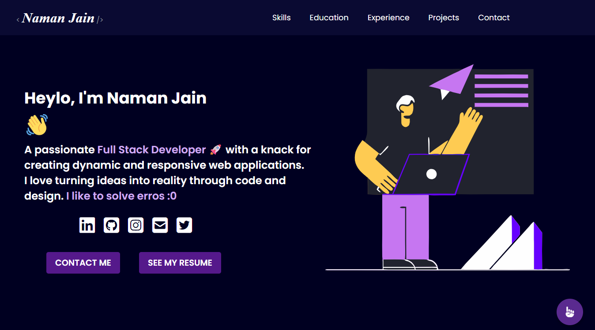

# 🌐 Personal Portfolio Website

Welcome to my personal portfolio website!  
This site showcases my skills, projects, experience, and contact details in a clean and interactive format. It’s fully responsive and built using modern web technologies.

## 🚀 Live Preview

🌍 [View Portfolio](https://your-portfolio-link.com)

## 📁 Tech Stack

- **Technologies:** HTML, CSS
- **Other:** Responsive Design, Smooth Scrolling, Animations

## 🧩 Features

- 🖥️ Responsive design for all devices
- ✨ Smooth scrolling navigation
- 💡 Animated sections on scroll
- 🔗 Clickable social/contact buttons
- 📄 Projects section with live/demo links
- 🧑‍💻 Experience & education timeline
- 📬 Contact section with email/phone links

## 📸 Screenshots




*(Add your own screenshots in a `/screenshots` folder)*

## 📂 Folder Structure

```
portfolio/
│
├── index.html
├── css
    └── styles.css
├── assets/
├── images/
├── README.md
└── screenshots/
```

## ⚙️ Setup & Run Locally

1. Clone the repository:
   ```bash
   git clone https://github.com/Naman85Jain/portfolio-website.git
   ```

2. Navigate to the project folder:
   ```bash
   cd portfolio
   ```

3. Open `index.html` in your browser:
   ```bash
   start index.html
   ```

> No build tools needed. It’s a static site!

## ✍️ Customization

- Replace content in `index.html` with your own information.
- Update images and icons inside `/assets`.
- Modify colors and styles in `style.css`.

## 📧 Contact

Want to connect?

- Email: worknamana404@gmail.com
- Phone: +91-8591875085
- LinkedIn: [Naman Jain](https://www.linkedin.com/in/namanjain85/)

---

### ⭐ Give a star if you like it!  
Happy Coding! 💻
